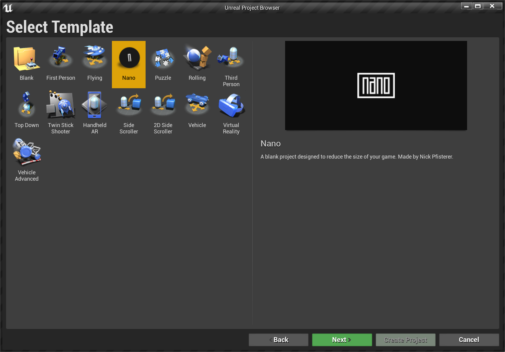
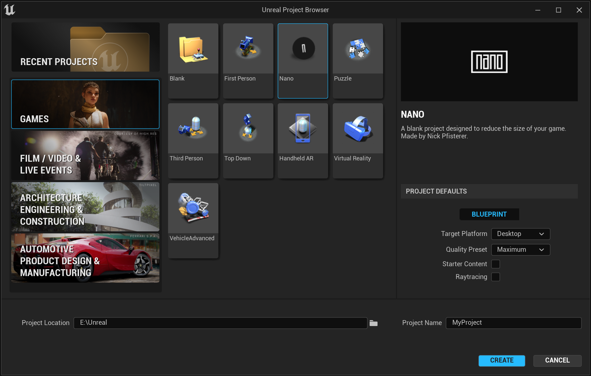
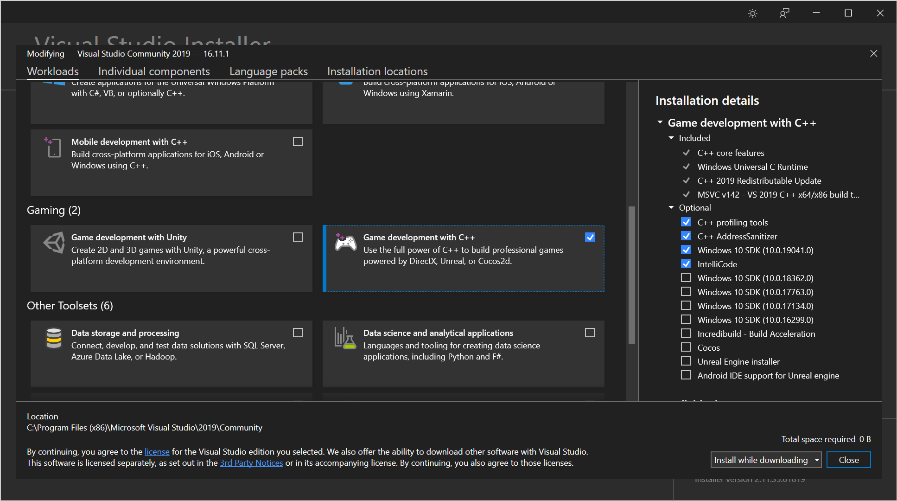
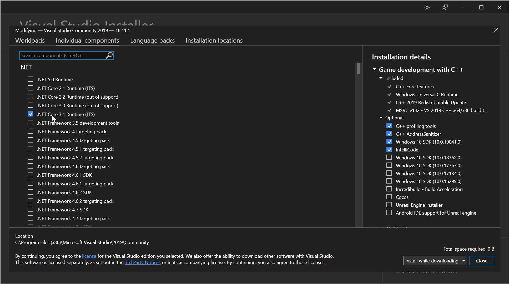

Nano is a tiny project template for people who want to make tiny games with UE4 and UE5. It was created to support developers competing for the Tiny Award in Epic's Unreal game jams, which requires your game to be under 150 MB. The Tiny Award tends to raise a lot of questions in the community about how to make a game so small, so I created this template to give people a head start.

> ⚠ If you're going for the Tiny Award in an Unreal game jam, you'll have to skip Unreal Engine 4.27 because Nano won't get you below the 150 MB limit. It currently works with 4.26 or older, as well as Unreal Engine 5 Early Access.

## Benchmarks
Here's how Nano compares to the blank template that ships with UE4 and UE5. Numbers are based on the Shipping build configuration
### Unreal Engine 4.26
|       | 64-bit | 32-bit |
| ----- | ------ | ------ |
| Blank | 211 MB | 176 MB |
| Nano  | 113 MB | 95 MB  |

### Unreal Engine 5 Early Access
|       | 64-bit | 32-bit |
| ----- | ------ | ------ |
| Blank | 240 MB | N/A |
| Nano  | 127 MB | N/A  |

## How it works
To help achieve its small size, Nano comes out of the box with the following configuration:

- Windows only
- DirectX 11 & 12 only
- Shipping build config
- No editor content
- Default game map set to Entry (an empty map included with the engine)
- Shared material code & libraries
- Compressed cooked packages
- Oculus VR and Steam VR plugins disabled
- Magic Leap plugins disabled
- No prerequisites installer

> ⚠ Excluding the prerequisites installer means your game may not work for players who have never played a UE4 or UE5 game before. This is fine for Unreal game jams because the rules don't require you to include it, but if you want your game to be accessible to more players, consider packaging a second build that includes the prerequisites installer.

There are ways to reduce the size of your game even further — such as blacklisting engine content — but this template focuses on modifications that have significant results while remaining safe and usable for most developers.

## Installation
To use Nano, download the latest release for your engine version and copy it to the templates directory (e.g. `Epic Games/UE_4.26/Templates/`). Once you do this, Nano should appear as a template option in the New Project dialog.

### Unreal Engine 4

### Unreal Engine 5

## Packaging your game
**Visual Studio is required to package your game with Nano.** I use Visual Studio Community 2019.

If you're a Blueprint programmer like me, fear not! You don't have to use Visual Studio or write any C++; just install it with the appropriate components selected and you should be good to go.

> Nano uses the Development build config out of the box so you can use Print String nodes, console commands, and other development-only features. When it's time to package the final version of your game, remember to set your build config to Shipping to get the smallest size!

### Unreal Engine 4
Select **Game development with C++** in the Workloads tab.

### Unreal Engine 5
Select **Game development with C++** in the Workloads tab, then add **.NET 3.1 Core Runtime** in the Individual Components tab.

## Credits
- The font used in the Nano logo is [Playlines](https://creativemarket.com/putracetol/2962806-Playlines-Typeface) by PutraCetol Studio
- Whomever at Epic Games wrote [this article](https://docs.unrealengine.com/en-us/Engine/Performance/ReducingPackageSize) on reducing your package size
- Heff, Tate Hartel, and AzorMachine from the #game-jam-chat channel on [Unreal Slackers](https://unrealslackers.org) for their tips on reducing package size
